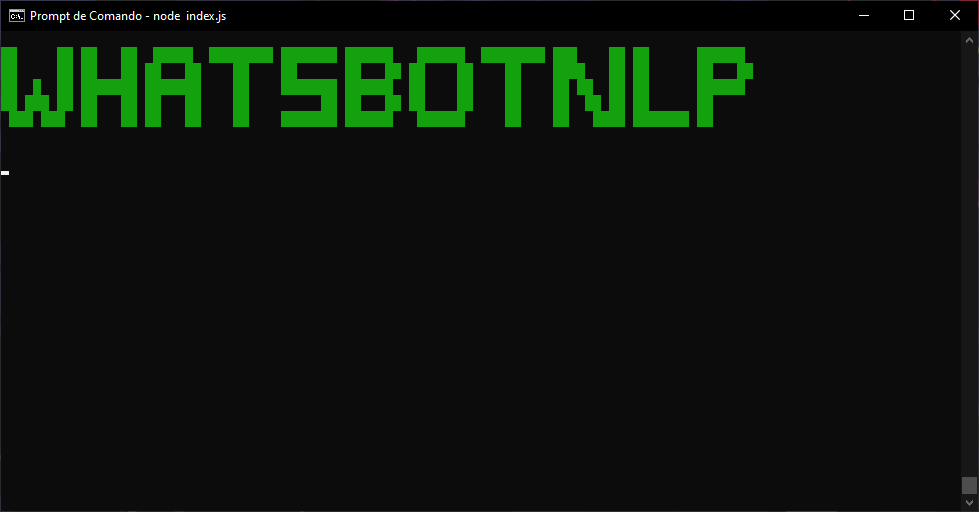
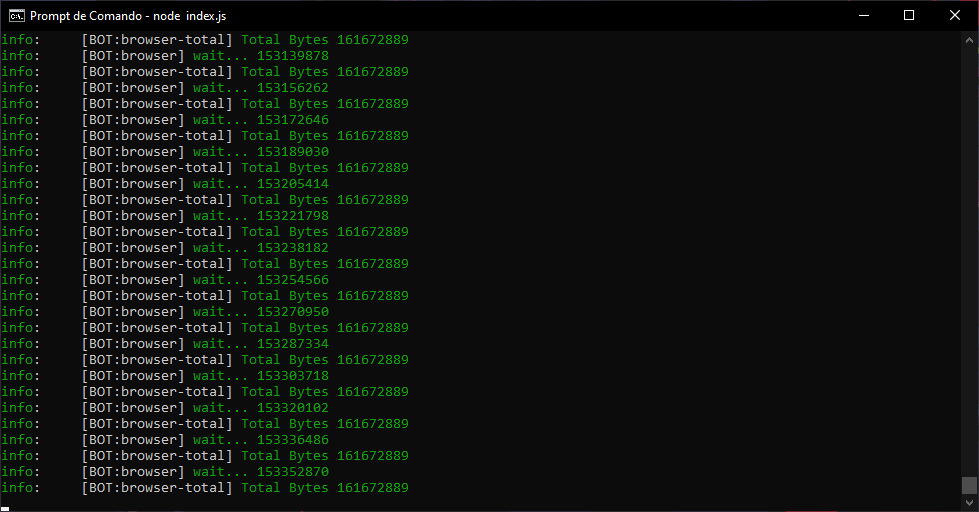

<h1 align=center>🕊WhatsBotNlp</h1>

## License

[](LICENSE)

<h3 align=center>Bot de respostas para WhatsApp usando Node.js</h3>

WhatsBotNlp é um script em `Node.js` para o envio de resposta inteligente com IA usando ´NLP.js´.
caso queira um bot apenas para o envio de mensagens em massa para contatos aleatorios recomendo dar uma olhada em <a href="https://github.com/carlosalberto/WhatsBot">WhatsBot</a>.

<div align=center>
  
</div>

## Instalação:

<div style="display: flex;">  
    
</div>

```
git clone https://github.com/CarlosAllberto/WhatsBotNlp
cd WhatsBotNlp
sudo apt install node npm -y
npm install
node index.js
```

Em uma linha:

```
git clone https://github.com/CarlosAllberto/WhatsBotNlp && cd WhatsBotNlp && sudo apt install node npm -y && npm install && node index.js
```

<br/>

<div style="display: flex;">  
    
</div>

```
git clone https://github.com/CarlosAllberto/WhatsBotNlp
cd WhatsBotNlp
sudo pacman -S nodejs npm -y
npm install
node index.js
```

Em uma linha:

```
git clone https://github.com/CarlosAllberto/WhatsBotNlp && cd WhatsBotNlp && sudo pacman -S nodejs npm -y && npm install && node index.js
```

`obs: é normal na primeira executação baixar um pacote de algums bytes como na imagem abaixo`

<div align=center>
  
</div>

## License

[](LICENSE)
